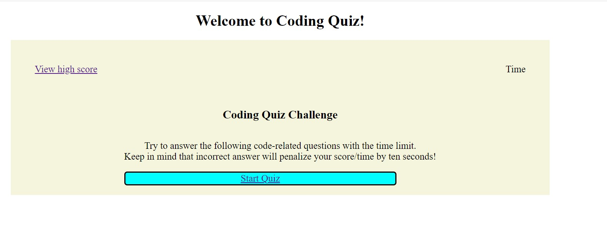
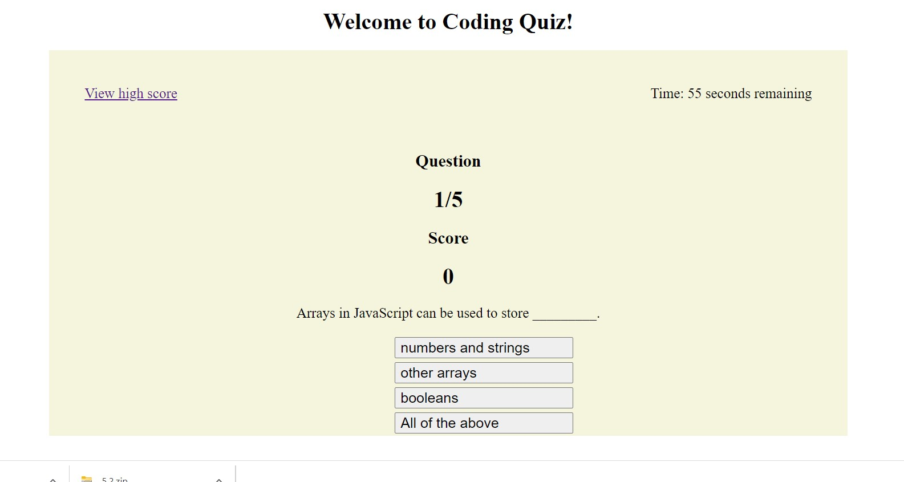
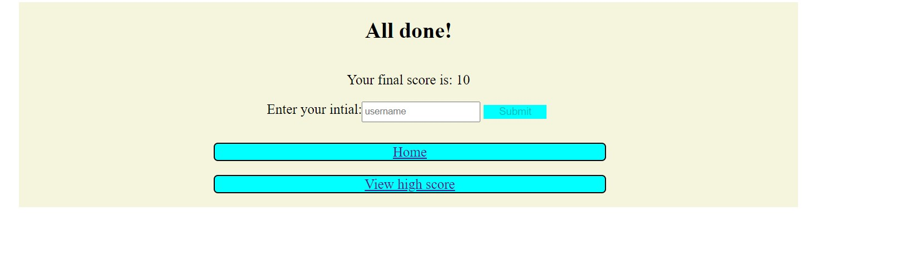
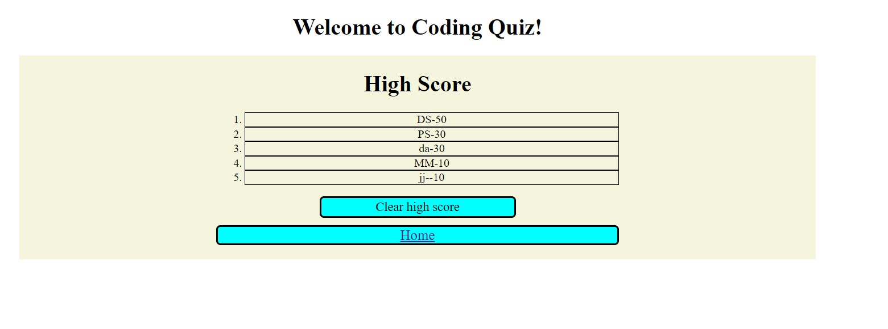
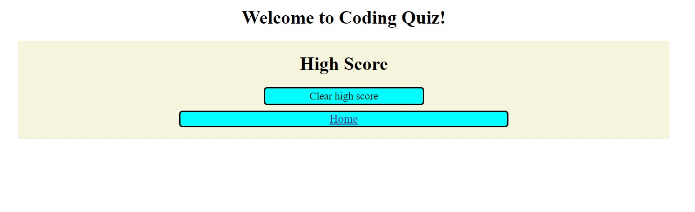

# Coding Quiz

# Purpose
This application allows user to take a coding quiz. It consits of 5 questions, and allow user to answer question in 60 seconds.
A user anwers correcty, the answer button will turn green and the score will be add by 10. If the user answer incorrectly, the answer button will turn to red and the application will subtract 10 point from the score and the time will reduce by 10 second.
After the time expired, use will not be able to take the test. 
It will take the user to the result form where user can enter their intial. 
The application will keep track of the top five high score. User is allowed to clear the high score, and go back to the home page. 

- when user click on Start Quiz, the application will load the quiz page. The page is showing the number of question that the user is on, currentl score, a timer and a link to high score page. 

- After taking the quiz, the application will take the user to the result page, where user can enter their inital, and submit their score to the high score list.

- When user submit their intial and score, it will take them to the high score page which keep track of 5 users that has the high score.

- User is able to clear high score or go back to the homepage

# Built with
* HTML
* CSS
* JavaScript

# Deployment

To deploy this project go to https://moniquemeas.github.io/Java-quiz/

# Contribution

Monique Meas
